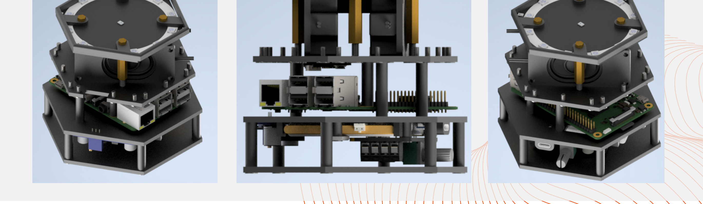
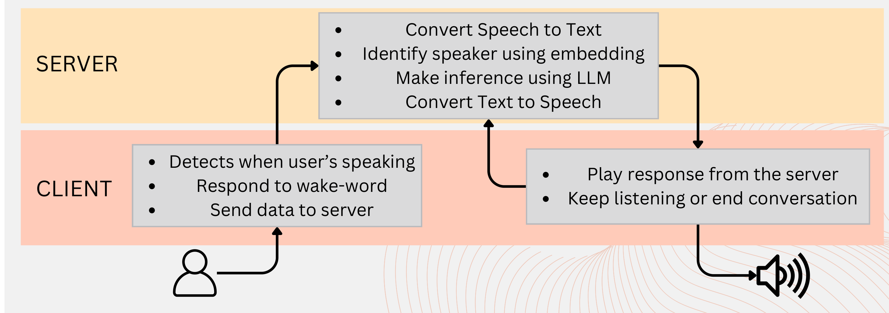
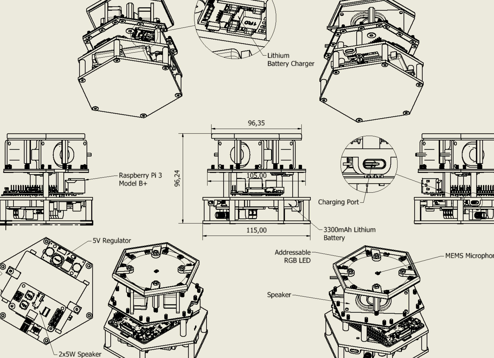

# Marvin — A Voice Assistant on Custom Hardware


Marvin is a client/server voice assistant running on a purpose-built
device. The client — a Raspberry Pi 3 Model B+ with a 7-microphone array,
12 addressable RGB LEDs, stereo speakers and a battery in a 3D-printed
casing — detects speech, responds to a wake word, and streams audio to the
server. The server runs the pipeline: speaker diarization and
identification via embeddings, speech-to-text, an LLM for the response, and
text-to-speech, serving multiple clients in real time.

Final project for the **Artificial Intelligence for Science and
Technology** course, MSc in Artificial Intelligence (University of
Milano-Bicocca, A.Y. 2024/2025), with Andrea Yachaya.

<p align="center"></p>
<p align="center"><em>The 3D-printed client: hexagonal microphone array on
top, Raspberry Pi and audio/battery boards stacked below. CAD renders from
the project presentation.</em></p>

## Architecture

<p align="center"></p>
<p align="center"><em>Data flow: the client captures audio on wake word and
sends it to the server, which runs diarization, STT, LLM inference and TTS,
then returns audio for playback. Source: project presentation.</em></p>

- **Client** (`Final_Project/client/`): wake-word detection and
  voice-activity detection on-device, LED feedback sequences, audio capture
  and playback, socket communication with the server.
- **Server** (`Final_Project/server/`): speaker diarization + enrollment
  via embeddings (`enroll_speaker.py`), speech-to-text, LLM inference,
  text-to-speech (`audio_processing.py`, `server.py`); handles multiple
  concurrent clients.

## Hardware

<p align="center"></p>
<p align="center"><em>Labelled assembly: Raspberry Pi 3 Model B+, 3300 mAh
lithium battery with charger, 5 V regulator, 2×5 W speaker amplifier, MEMS
microphones and addressable RGB LEDs, ~115 mm across. Source: project
presentation.</em></p>

Microphones are read over I²S; the RGB LEDs are driven over I²C. Power
comes from a lithium battery through a boost regulator sized for the Pi.

## How to run

```sh
pip install -r Final_Project/requirements.txt
python Final_Project/server/main.py     # on the server machine
python Final_Project/client/main.py     # on the Raspberry Pi client
```

Wake-word training lives in `Final_Project/training/`; enroll a speaker
with `Final_Project/server/enroll_speaker.py`.

## Presentation

Full slides: [Morello_Yachaya_Presentation.pdf](Final_Project/Morello_Yachaya_Presentation.pdf)
— Mirko Morello, Andrea Yachaya, 2025.
