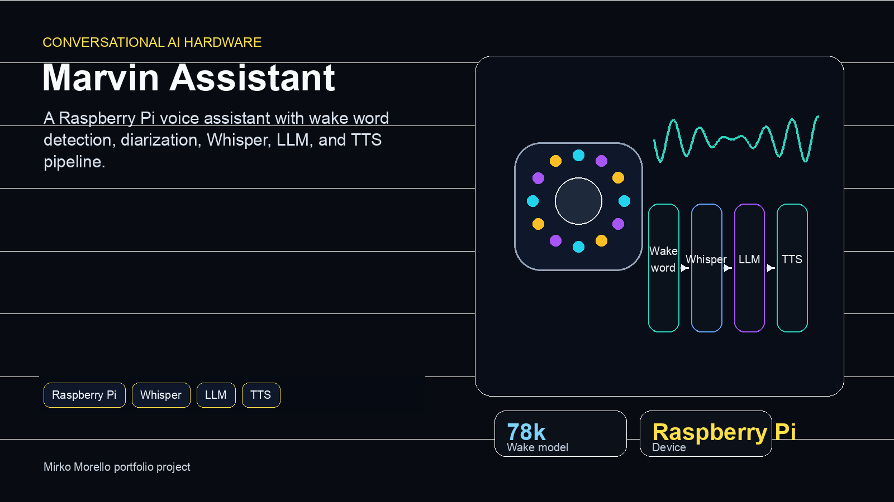

# Marvin: AI-Powered Voice Assistant

<div align="center">

**An Intelligent Question-Answering AI Consumer Technology Product**

*Artificial Intelligence For Science and Technology - A.Y. 2024/2025*

Università Degli Studi di Milano-Bicocca

**Authors:** Andrea Yachaya (913721) & Mirko Morello (920601)

</div>

<p align="center">
  
</p>

---

## 📋 Table of Contents

- [Overview](#overview)
- [System Architecture](#system-architecture)
- [Hardware Components](#hardware-components)
- [Software Components](#software-components)
  - [Client (Raspberry Pi)](#client-raspberry-pi)
  - [Server Pipeline](#server-pipeline)
- [Key Features](#key-features)
- [Technical Implementation](#technical-implementation)
  - [Wake Word Detection](#wake-word-detection)
  - [Speaker Diarization & Identification](#speaker-diarization--identification)
  - [Speech-to-Text (STT)](#speech-to-text-stt)
  - [Large Language Model (LLM)](#large-language-model-llm)
  - [Text-to-Speech (TTS)](#text-to-speech-tts)
- [Installation & Setup](#installation--setup)
- [Usage](#usage)
- [Performance Metrics](#performance-metrics)
- [Future Work](#future-work)
- [License](#license)

---

## 🎯 Overview

**Marvin** is an AI-based virtual assistant prototype designed as a consumer technology product, built from scratch using modern speech and language models. The project demonstrates a complete end-to-end conversational AI system with custom hardware integration, featuring:

- **Partial Privacy-First Design**: Wake word detection runs on-device before audio is sent to the server pipeline
- **Multi-Speaker Support**: Real-time speaker identification and diarization
- **Natural Conversations**: Context-aware responses using Llama 8B
- **Physical Device**: Custom 3D-printed enclosure with Raspberry Pi hardware
- **Interactive Prototype**: Optimized enough for live demos, with room for lower-latency production serving

### Project Goals

1. Design a working AI-based virtual assistant
2. Enable the client to listen, communicate with server, and play audio responses
3. Implement server capabilities for:
   - Speaker diarization and identification using embeddings
   - Speech-to-text transcription
   - LLM-based intelligent responses
   - Text-to-speech synthesis
4. Support a responsive single-device prototype and document the path toward parallel multi-client serving

---

## 🏗️ System Architecture

```
┌─────────────────────────────────────────────────────────────────────┐
│                            CLIENT DEVICE                             │
│  ┌────────────────────────────────────────────────────────────────┐ │
│  │ 1. Detects when user is speaking (VAD)                         │ │
│  │ 2. Responds to wake-word ("Marvin")                            │ │
│  │ 3. Sends audio data to server                                  │ │
│  │ 4. Plays response from server                                  │ │
│  │ 5. Visual feedback through 12 RGB LEDs                         │ │
│  └────────────────────────────────────────────────────────────────┘ │
│                               ▲  │                                   │
│                               │  │                                   │
│                      Audio    │  │  Audio                            │
│                               │  ▼                                   │
└───────────────────────────────┼──┼───────────────────────────────────┘
                                │  │
                    TCP Socket (Port 8080)
                                │  │
┌───────────────────────────────┼──┼───────────────────────────────────┐
│                            SERVER                                     │
│  ┌────────────────────────────────────────────────────────────────┐ │
│  │ 1. Audio Reception & Pre-processing                            │ │
│  │ 2. Speaker Diarization (pyannote 3.1)                          │ │
│  │ 3. Speaker Identification (embedding-based)                    │ │
│  │ 4. Speech-to-Text (Whisper Large v3 Turbo)                     │ │
│  │ 5. LLM Processing (Llama 8B Instruct)                          │ │
│  │ 6. Text-to-Speech (Kokoro TTS)                                 │ │
│  │ 7. Response Transmission                                       │ │
│  └────────────────────────────────────────────────────────────────┘ │
└───────────────────────────────────────────────────────────────────────┘
```

### Communication Protocol

The system uses a **custom binary protocol over TCP** for minimal overhead:
- Built on top of TCP (Layer 4)
- Custom binary format at Layer 7
- Supports audio streaming and state synchronization
- Server listens on `0.0.0.0:8080`

**Message Format:**
```
┌──────────────┬──────────────────────────────────────┐
│ Size (4 bytes)│  Data (N bytes)                     │
│ (int32, big-endian) │  (float32 audio or JSON)     │
└──────────────┴──────────────────────────────────────┘
```

---

## 🔧 Hardware Components

### Client Device Specifications

The client is a **Raspberry Pi 3 Model B+** enclosed in a custom 3D-printed hexagonal case with integrated components:

#### Components:
- **Microcontroller**: Raspberry Pi 3 Model B+
- **Microphone Array**: ReSpeaker 7-mic array with beamforming
- **LEDs**: 12 addressable RGB LEDs (WS2812B)
- **Speakers**: 2× 5W speakers (stereo output)
- **Amplifier**: Integrated speaker amplifier
- **Battery**: 3300mAh Lithium battery
- **Power Management**: Battery manager with 5V voltage regulator
- **Enclosure**: Custom 3D-printed hexagonal case
  - Dimensions: 115mm × 105mm × 96mm
  - Weight: ~400g with battery

#### Electrical Connections

**Communication Protocols:**
- **I²C** (Inter-Integrated Circuit): LED control
  - SDA (GPIO 10): Data line
  - SCL (GPIO 11): Clock line
- **I²S** (Inter-IC Sound): Microphone array
  - SCK (GPIO 18): Bit clock
  - WS (GPIO 19): Word select (channel selection)
  - SD (GPIO 20, 21, 26, 16): 4 data lines for 7 microphones

**Pinout Configuration:**

| Signal          | GPIO Pin | Physical Pin | Notes                    |
|-----------------|----------|--------------|--------------------------|
| LED_SCLK        | GPIO 11  | 23           | LED clock (SPI)          |
| LED_MOSI        | GPIO 10  | 19           | LED data (SPI)           |
| MIC_D0          | GPIO 21  | 40           | Microphone data line 0   |
| MIC_D1          | GPIO 20  | 38           | Microphone data line 1   |
| MIC_D2          | GPIO 26  | 37           | Microphone data line 2   |
| MIC_D3          | GPIO 16  | 36           | Microphone data line 3   |
| MIC_WS          | GPIO 19  | 35           | Word select/LRCK         |
| MIC_CK          | GPIO 18  | 12           | PCM clock                |

---

## 💻 Software Components

### Client (Raspberry Pi)

The client software is responsible for audio capture, wake word detection, and user interaction feedback.

#### Key Modules:

**1. Main Client (`Final_Project/client/main.py`)**
- Initializes audio parameters and model
- Creates client instance and manages main loop

**2. Client Logic (`Final_Project/client/client.py`)**
- Manages socket connection to server
- Implements state machine for conversation flow
- Handles audio streaming and response playback

**3. Wake Word Detection Model (`Final_Project/client/model.py`)**
- Custom MatchboxNet-inspired architecture
- 77,987 trainable parameters (7.27 MB model size)
- Processes audio through MFCC preprocessing
- Uses Jasper blocks with depthwise separable convolutions

**4. Voice Activity Detection (`Final_Project/client/utils/vad.py`)**
- Energy-based VAD with exponential smoothing
- Detects when user stops speaking
- Adaptive threshold for different environments

**5. LED Animation System (`Final_Project/client/led_sequences/`)**
- Multiple animation patterns for different states:
  - **Waiting**: Rainbow pulse
  - **Listening**: Rotating orange/cyan
  - **Processing**: Red circular loading
  - **Thinking**: Blue pulse
  - **Speaking**: White breathing

#### Client States:

1. **WAKEWORD** 🔴: Waiting for wake word detection
2. **VAD** 🟢: Listening to user conversation
3. **VOICE_RECEIVED**: Grace period before sending
4. **STT_DIARIZATION** 🔵: Server processing audio
5. **LLM** 🟣: Server generating response
6. **TTS** 🟠: Server converting to speech
7. **PLAYING**: Playing server response

---

### Server Pipeline

The server implements a sophisticated multi-stage pipeline for audio processing and response generation.

#### Processing Flow:

```
Audio Reception
      ↓
Pre-Processing (WAV conversion)
      ↓
Diarization (Speaker segmentation)
      ↓
Embedding Extraction (Per segment)
      ↓
Speaker Identification
      ↓
Speech-to-Text (Per segment)
      ↓
Aggregation & Context Formation
      ↓
LLM Processing
      ↓
Text-to-Speech
      ↓
Response Transmission
```

#### Key Modules:

**1. Server Core (`Final_Project/server/server.py`)**
- Manages TCP socket connections
- Handles client sessions sequentially in the current prototype
- Coordinates pipeline execution
- Sends responses with state information

**2. Audio Processing (`Final_Project/server/audio_processing.py`)**
- Integrates diarization and STT pipelines
- Manages temporary audio files
- Coordinates speaker identification

**3. Speaker Identification (`Final_Project/server/utils/speaker_id.py`)**
- Loads enrolled speaker database
- Extracts embeddings for segments
- Compares with database using cosine similarity
- Threshold-based speaker matching

**4. LLM Handler (`Final_Project/server/utils/llm_handler.py`)**
- Loads Llama 8B Instruct model
- Custom prompt engineering for home assistant context
- Generates concise, context-aware responses

**5. TTS Handler (`Final_Project/server/utils/tts_handler.py`)**
- Kokoro TTS engine integration
- Phoneme-based speech synthesis
- GPU-accelerated generation

**6. Speaker Enrollment (`Final_Project/server/enroll_speaker.py`)**
- Records 20× 3-second utterances per speaker
- Computes averaged embedding centroids
- Stores in JSON database with L2 normalization

---

## ✨ Key Features

### 1. Privacy-Preserving Wake Word Detection
- **On-device processing**: No audio sent to server until wake word detected
- **Custom lightweight model**: Only 77k parameters
- **High accuracy**: 94.02% on test set
- **Fast inference**: ~5ms per inference on Raspberry Pi

### 2. Multi-Speaker Conversation Support
- **Speaker diarization**: Automatic segmentation by speaker
- **Speaker identification**: Embedding-based recognition
- **Contextual understanding**: LLM receives full conversation context with speaker labels

### 3. Natural Language Understanding
- **Llama 8B model**: 8 billion parameters loaded with `bfloat16` weights in the current server code
- **Custom system prompt**: Optimized for home assistant behavior
- **Context-aware**: Understands multi-turn conversations

### 4. Real-time Visual Feedback
- **12 RGB LEDs**: Visual indication of system state
- **Smooth animations**: Professional-looking transitions
- **Multiple patterns**: Different animations for each state

### 5. Low-Latency Communication
- **Custom protocol**: Minimal overhead compared to WebSockets
- **Optimized pipeline**: Parallel processing where possible
- **Efficient serialization**: Binary format for audio data

---

## 🔬 Technical Implementation

### Wake Word Detection

#### Model Architecture

Based on MatchboxNet principles with custom adaptations:

```
Input Audio (16kHz, 1 second)
      ↓
AudioToMFCCPreprocessor
  - 64 MFCC features
  - n_fft: 512
  - hop_length: 160
      ↓
ConvASREncoder (6 Jasper Blocks)
  Block 1: 64 → 128 channels, k=11
  Block 2: 128 → 64 channels, k=13 (residual)
  Block 3: 64 → 64 channels, k=15 (residual)
  Block 4: 64 → 64 channels, k=17 (residual)
  Block 5: 64 → 128 channels, k=29, dilation=2
  Block 6: 128 → 128 channels, k=1
      ↓
ConvASRDecoderClassification
  - AdaptiveAvgPool1d
  - Linear(128 → 35 classes)
      ↓
Output: Class predictions
```

**Jasper Block Structure:**
- Depthwise separable convolution
- Pointwise (1×1) convolution
- Batch normalization
- ReLU activation
- Optional residual connections
- Dropout regularization

#### Training Details

- **Dataset**: Google Speech Commands V2
  - 35 classes
  - 105,829 training samples
- **Optimizer**: Adam
- **Loss**: CrossEntropyLoss
- **Scheduler**: ReduceLROnPlateau
- **Batch size**: 64
- **Initial LR**: 0.001
- **Epochs**: 20
- **Final accuracy**: 94.02%

#### Performance Metrics

| Metric                      | Value     |
|-----------------------------|-----------|
| Total Parameters            | 77,987    |
| Model Size                  | 7.27 MB   |
| Single Sample Inference     | ~5ms      |
| Avg Batch Inference (64)    | 137ms     |
| Input Size                  | 0.06 MB   |
| Forward/Backward Pass Size  | 1.66 MB   |

---

### Speaker Diarization & Identification

#### Enrollment Process

```python
# For each speaker:
1. Record 20 audio clips (3 seconds each)
2. Extract embedding for each clip using pyannote/embedding
3. Average all embeddings → centroid
4. L2-normalize centroid
5. Store in JSON database with speaker name
```

**Embedding Model**: `pyannote/embedding`
- Pre-trained on VoxCeleb
- 512-dimensional embeddings
- Sliding window: 1.5s with 0.75s step

#### Real-time Identification

```python
# For each diarized segment:
1. Extract embedding using same model
2. L2-normalize embedding
3. Compute cosine similarity with all enrolled speakers:
   similarity = dot_product(segment_emb, speaker_centroid)
4. If max_similarity > threshold (e.g., 0.75):
   → Assign speaker name
   else:
   → Label as "Unknown"
```

**Advantages:**
- Fast: O(n) for n enrolled speakers
- Robust: Averaged centroids reduce noise
- Scalable: Can handle many speakers
- Privacy-preserving: Embeddings stored locally

---

### Speech-to-Text (STT)

**Model**: OpenAI Whisper Large v3 Turbo
- **Parameters**: 809M
- **VRAM requirement**: ~6GB
- **Features**:
  - Handles varying audio quality
  - Robust to background noise
  - Multilingual support (though English used)
  - Punctuation and formatting

**Processing Strategy:**
- Process each diarized segment individually
- Maintains speaker context
- Aggregates transcripts with timestamps
- Improves accuracy with shorter, focused segments

---

### Large Language Model (LLM)

**Model**: Meta-Llama-3-8B-Instruct
- **Parameters**: 8 billion
- **Memory mode**: `bfloat16` model loading for memory efficiency
- **VRAM usage**: 6-8GB
- **Context window**: Handles full conversation history

**Custom System Prompt:**
```
You are Marvin, a helpful home speaker assistant.
You are having a conversation with multiple people in a room.
Provide concise, friendly responses that are natural when spoken aloud.
Keep responses brief (1-3 sentences) unless more detail is explicitly requested.
```

**Context Format:**
```
[Speaker1]: Hello Marvin, what's the weather today?
[Speaker2]: Also, can you remind me about my meeting?
```

**Response Generation:**
- Streaming not used (full response generated)
- Temperature tuning for natural speech
- Max tokens limited for brevity
- Context includes speaker labels

---

### Text-to-Speech (TTS)

**Model**: Kokoro TTS
- **Parameters**: 82M
- **Voice**: "af" (configurable via environment)
- **Processing**: GPU-accelerated
- **Output**: 16kHz WAV format

**Pipeline:**
```
Text Input
    ↓
Phoneme Sequence Generation
    ↓
Neural Vocoder
    ↓
Waveform Synthesis
    ↓
Audio Output (16kHz, mono)
```

**Advantages:**
- Natural-sounding speech
- Fast generation (~100-250ms for typical response)
- Consistent voice quality
- Low latency for real-time use

---

## 📦 Installation & Setup

### Server Setup

#### Prerequisites
- Python 3.8+
- CUDA-capable GPU (16GB+ VRAM recommended)
- Ubuntu 20.04+ or similar Linux distribution

#### Installation

1. **Clone the repository:**
```bash
git clone https://github.com/MirkoMorello/MSc_ICT.git
cd MSc_ICT/Final_Project
```

2. **Create virtual environment:**
```bash
python3 -m venv venv
source venv/bin/activate
```

3. **Install dependencies:**
```bash
cd Final_Project
pip install -r requirements.txt
```

4. **Set up environment variables:**
```bash
# Create .env file in Final_Project directory
cat > .env << EOF
HF_AUTH_TOKEN=your_huggingface_token_here
KOKORO_LANG_CODE=a
EOF
```

5. **Enroll speakers (optional but recommended):**
```bash
cd server
python enroll_speaker.py
# Follow prompts to record 20 samples per speaker
```

6. **Start the server:**
```bash
cd server
python main.py
```

Server will start listening on `0.0.0.0:8080`

---

### Client Setup (Raspberry Pi)

#### Prerequisites
- Raspberry Pi 3 Model B+ or newer
- ReSpeaker 7-mic array
- Raspbian OS (Bullseye or newer)
- Speakers connected to audio jack
- Internet connection

#### Installation

1. **Clone repository on Pi:**
```bash
git clone https://github.com/MirkoMorello/MSc_ICT.git
cd MSc_ICT/Final_Project
```

2. **Install system dependencies:**
```bash
sudo apt-get update
sudo apt-get install python3-pip python3-pyaudio portaudio19-dev
sudo apt-get install libatlas-base-dev  # For NumPy
```

3. **Install Python dependencies:**
```bash
cd Final_Project
pip3 install -r requirements.txt
```

4. **Configure server address:**
```bash
# Edit client/utils/config.py
nano client/utils/config.py
# Set SERVER_ADDRESS to your server's IP
```

5. **Run client:**
```bash
cd client
python3 main.py
```

---

## 🚀 Usage

### Basic Interaction Flow

1. **Wake the Assistant:**
   - Say "Marvin" clearly
   - LEDs will show rainbow pattern when listening
   - Wait for acknowledgment sound

2. **Ask Your Question:**
   - Speak naturally after wake word
   - LEDs show listening state (orange/cyan rotation)
   - System detects when you stop speaking

3. **Processing:**
   - LEDs show red loading animation
   - Server processes audio
   - Blue pulse indicates LLM thinking

4. **Response:**
   - White breathing pattern during speech
   - Audio plays through speakers
   - Returns to wake word listening after response

### Example Conversations

**Single User:**
```
User: "Marvin, what's the capital of France?"
Marvin: "The capital of France is Paris, known for the Eiffel
         Tower and rich cultural history."
```

**Multiple Users:**
```
Alice: "Marvin, what's the weather like?"
Marvin: "I don't have real-time weather data, but I can help
         with other questions."
Bob: "Can you tell us a joke?"
Marvin: "Sure! Why don't scientists trust atoms? Because they
         make up everything!"
```

### Ending Conversation

Say goodbye phrases to end:
- "Goodbye Marvin"
- "That's all"
- "Thank you, bye"
- "See you later"

---

## 📊 Performance Metrics

### Wake Word Detection

| Metric                  | Value   |
|-------------------------|---------|
| Test Accuracy           | 94.02%  |
| Model Size              | 7.27 MB |
| Inference Time (RPi 3)  | ~5ms    |
| False Positive Rate     | ~6%     |
| False Negative Rate     | ~6%     |

### Server Processing Times

**Average Processing Times (per conversation):**

| Component            | Time (ms)  | Notes                      |
|----------------------|------------|----------------------------|
| Diarization          | 2000-6000  | Varies with audio length   |
| STT (per segment)    | 500-1500   | Depends on segment length  |
| Speaker ID           | 50-200     | Fast embedding comparison  |
| LLM Generation       | 2000-8000  | Depends on response length |
| TTS                  | 100-250    | Fast synthesis             |
| **Total Pipeline**   | **5000-17000** | ~5-17 seconds total    |

**Throughput:**
- Single conversation: ~5-17 seconds end-to-end
- Can handle 1 client at a time (sequential processing)
- Low network latency: <100ms for audio transfer

### Resource Usage

**Server (GPU):**
- VRAM: ~14-16GB (all models loaded)
- CPU: 4-8 cores recommended
- RAM: 16GB+ recommended
- Disk: ~20GB for models

**Client (Raspberry Pi 3):**
- CPU: ~15-25% during wake word detection
- RAM: ~200MB
- Storage: ~100MB (including model)

---

## 🔮 Future Work

### Planned Improvements

1. **Context-Aware Conversation Termination**
   - Replace keyword-based termination with sentiment analysis
   - Use BERT-based models (e.g., BERTa from Meta)
   - Infer natural conversation endpoints

2. **Smart Home Integration**
   - Agent-based framework for device control
   - API integration for:
     - Lights (Phillips Hue, etc.)
     - Thermostats
     - Door locks
     - Entertainment systems
   - Time and weather information
   - Calendar and reminder management

3. **Performance Optimization**
   - Streaming TTS for lower latency
   - Model quantization (INT8) for faster inference
   - Parallel processing for multiple clients
   - Caching for common queries

4. **Enhanced Privacy**
   - On-device STT for sensitive queries
   - Encrypted audio transmission
   - Local LLM option for privacy-conscious users
   - User data deletion policies

5. **Improved Hardware**
   - Upgrade to Raspberry Pi 4/5 for better performance
   - Add hardware button for wake-up
   - Battery level indicator
   - Better speaker quality

6. **Multilingual Support**
   - Multiple wake words for different languages
   - Language detection in STT
   - Multilingual TTS voices

---

## 🎓 Technical Challenges & Solutions

### Challenge 1: Low-Power Wake Word Detection
**Problem**: Commercial models (85M parameters) too large for Raspberry Pi
**Solution**: Custom MatchboxNet-inspired architecture (77k parameters, 7.27MB)
**Result**: 94% accuracy with 5ms inference time

### Challenge 2: Multi-Speaker Identification
**Problem**: Need to distinguish between different users
**Solution**: Enrollment system + embedding-based identification
**Result**: Robust speaker identification with <200ms overhead

### Challenge 3: Response Latency
**Problem**: Multiple heavy models causing delays
**Solution**:
- GPU acceleration for all models
- Optimized pipeline flow
- Custom binary protocol

**Result**: 5-17 second total latency (acceptable for conversational AI)

### Challenge 4: Hardware Integration
**Problem**: Complex electrical connections and protocols
**Solution**:
- Custom 3D-printed enclosure
- Proper I²C and I²S protocol implementation
- Comprehensive testing suite

**Result**: Reliable hardware operation with visual feedback

### Challenge 5: Network Reliability
**Problem**: Socket disconnections and timeouts
**Solution**:
- Automatic reconnection logic
- Timeout handling
- Error recovery mechanisms

**Result**: Stable client-server communication

---

## 📚 References & Technologies

### Models & Frameworks

- **Whisper Large v3 Turbo**: [OpenAI Whisper](https://github.com/openai/whisper)
- **Llama 3 8B**: [Meta Llama](https://ai.meta.com/llama/)
- **Pyannote Diarization**: [pyannote.audio](https://github.com/pyannote/pyannote-audio)
- **Kokoro TTS**: Speech synthesis engine
- **MatchboxNet**: [NVIDIA NeMo](https://arxiv.org/abs/2004.08531)

### Libraries

- **PyTorch**: Deep learning framework
- **Transformers**: Hugging Face library
- **PyAudio**: Audio I/O
- **NumPy**: Numerical computing
- **SciPy**: Scientific computing

### Hardware

- **Raspberry Pi**: Single-board computer
- **ReSpeaker**: Microphone array
- **WS2812B**: Addressable RGB LEDs

---

## 📄 License

This project is licensed under the MIT License - see the [LICENSE](LICENSE) file for details.

---

## 👥 Contributors

- **Mirko Morello** (920601)
  - Hardware design & integration
  - Client software development
  - Wake word model training
  - LED animation system

- **Andrea Yachaya** (913721)
  - Server pipeline development
  - Model integration
  - Speaker identification system
  - System architecture

---

## 🙏 Acknowledgments

- **Università Degli Studi di Milano-Bicocca** for academic support
- **Course**: Artificial Intelligence For Science and Technology (A.Y. 2024/2025)
- **Open Source Community** for excellent tools and libraries

---

## 📧 Contact

For questions, issues, or contributions, please open an issue on the GitHub repository.

**Repository**: [https://github.com/MirkoMorello/MSc_ICT](https://github.com/MirkoMorello/MSc_ICT)

---

<div align="center">

**Made with ❤️ for AI Education**

*Marvin - Your Friendly AI Assistant*

</div>
